# Mirrulations Data Tutorial: Extracting Comment Sentiment from Public Comments

## Overview

The [regulations.gov](https://www.regulations.gov/) website allows users to view proposed rules and supporting documents for the federal rule-making process.  As of 2024, the site contains about 27 million pieces of text and binary data that is valuable for data journalism.  As a public record of the rule-making process, it contains insights into the workings of federal agencies.  

[Mirrulations (MIRRor of regULATIONS.gov)](https://github.com/MoravianUniversity/mirrulations) is a system to create a mirror of the data, and all this data is available in the [mirrulations S3 bucket](https://mirrulations.s3.amazonaws.com/).  In this tutorial you will consider a single docket (proposed rule).  You will use [AWS Glue](https://aws.amazon.com/glue/) and [AWS Comprehend](https://aws.amazon.com/comprehend/) to extract the text of the public comments on this docket and perform sentiment analysis on that text.  Afterward you will use [AWS Athena](https://aws.amazon.com/athena/) to download a CSV file containing the results.

## Prerequisites

This tutorial assumes basic familiarity with AWS S3, AWS Glue, AWS Comprehend, and AWS Athena.  Each step will provide instructions on how to configure each service and provide relevant screenshots - but detailed explanation of the configuration options is not provided.

Unless specified, default configuration options are assumed for all services.

This tutorial will utilize \$40 to \$50 of AWS services.

## Understanding the Tutorial Data

In 2024, the DEA [proposed to transfer marijuana from schedule I of the Controlled Substances Act (“CSA”) to schedule III of the CSA.](https://apnews.com/article/marijuana-biden-dea-criminal-justice-pot-f833a8dae6ceb31a8658a5d65832a3b8).  The docket, [`DEA-2024-0059`](https://www.regulations.gov/docket/DEA-2024-0059) contains the proposed rule as well as the tens of thousands of public comments that were submitted.


The `mirrulations` data is stored in a [hierarchical structure](structure.md):

```
<agency>
└── <docket id>
    ├── binary-<docket id>
    │   ├── comments_attachments
    │   │   ├── <comment id>_attachement_<counter>.<extension>
    │   │   └── ...
    │   ├── documents_attachments
    │   │   ├── <document id>_attachement_<counter>.<extension>
    │   │   └── ...
    └── text-<docket id>
        ├── comments
        │   ├── <comment id>.json
        │   └── ...
        ├── comments_extracted_text
        │   ├── <tool name>
        │   |   ├── <comment id>_attachment_<counter>_extracted.txt
        │   |   └── ...
        |   └─ ... <other tools>
        ├── docket
        │   ├── <docket id>.json
        |   └── ...
        ├── documents
        │   ├── <document id>.json
        │   ├── <document id>_content.htm
        │   └── ...
        └── documents_extracted_text
            ├── <tool name>
            |   ├── <document id>_content_extracted.txt
            |   └── ...
            └─ ... <other tools>
```

The files we want are in `DEA/DEA-2024-0059/text-DEA-2024-0059/comments`.


Each comment file contains JSON data with the following format (extraneous fields omitted for clarity):


```
{
    "data": {
        "id": "DEA-2024-0059-0008",
        "attributes": {
            "comment": "<Comment text here>"
            "modifyDate": "2024-05-21T14:17:51Z",
        }
    }
}
```

## Create an IAM Role

To run the Glue job we have to specify an IAM role with sufficient permissions to access S3, Glue, and Comprehend.

* Create an IAM Role using Glue as the AWS service use case
* Add the permissions `AmazonS3FullAccess`, `AWSGlueConsoleFullAccess`, and `ComprehendFullAccess`
* Name the Role `DEA-2024-0059-S3-Glue-Comprehend`

  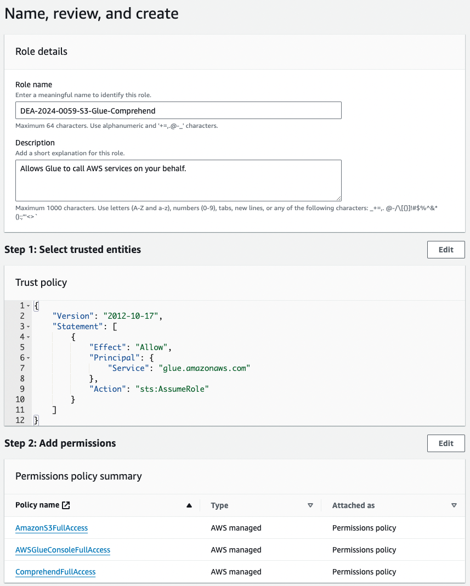


NOTE: For production workflows, you should restrict access to these services to comply with the [ principle of least privilege](https://docs.aws.amazon.com/IAM/latest/UserGuide/best-practices.html#grant-least-privilege).

## Create an AWS S3 Bucket to Hold Results

We will pull the data from the `mirrulations` S3 bucket, but we need a separate bucket where Glue and Athena can store results.  In this step you will create a bucket to hold this data.

* In S3, create a bucket to hold Glue and Athena results.  Remember, bucket names are globally unique, so we recommend using something like your lastname followed by `dea-2024-0059` (the docket ID).

  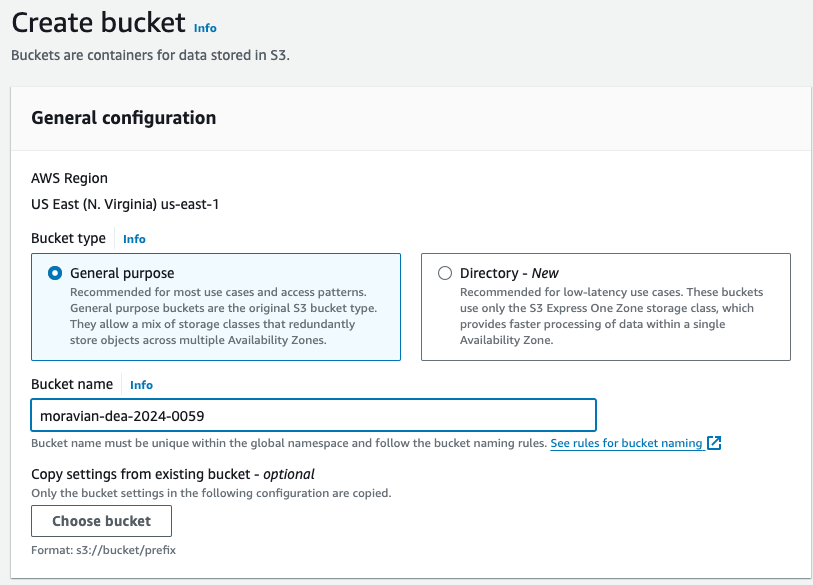
* In the bucket create two folders, `Glue` and `Athena`

  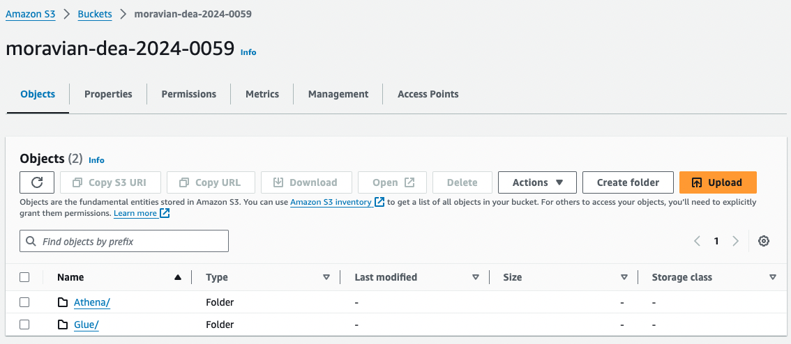

## Set up an AWS Glue Database

We will store our results in an AWS Glue Database so we can access it using AWS Athena.

* In the AWS Glue Dashboard under "Data Catalog" select "Databases" and then click "Add database."
* Name the database "mirrulations" and leave all other options their default value.

  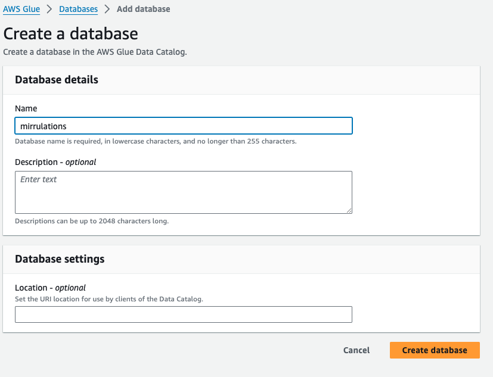

## Set up the AWS Glue ETL Job

We will use AWS Glue to extract the comments from the `DEA-2024-0059` docket, transform that data into a table containing the comment/sentiment analysis, and store the result in a database that AWS Athena can query.

* In the AWS Glue dashboard under "ETL Jobs" select "Visual ETL" and then click "Visual ETL" to create a new job.  Name the job "DEA-2024-0059."
* Click on "Job Details" and set the IAM Role to `DEA-2024-0059-S3-Glue-Comprehend`.

  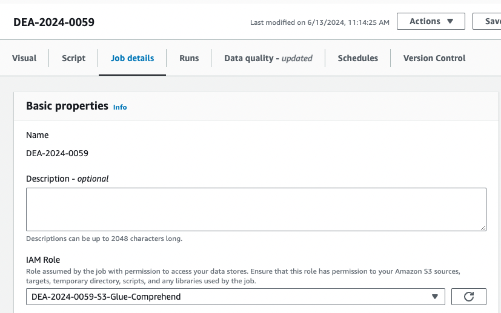


## Adding Nodes to the AWS Glue ETL Job

* Click on the "Visual" tab to return to the editor.
* Click the "+" to open the "Add Nodes" panel, and under "Sources," add an "Amazon S3" node.

  

* Click on the node and configure it to use the data from the `mirrulations` bucket

  * Set the S3 URL to `s3://mirrulations/DEA/DEA-2024-0059/text-DEA-2024-0059/comments`.
  
  * Set the "Data Format" to "JSON."
  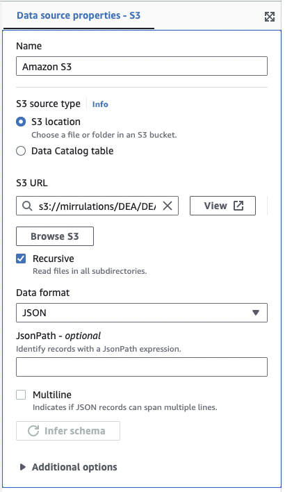
  

* Add a "Change Schema" transform node

  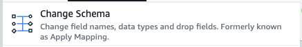

* Configure this node to remove all nodes *except* `data.id`, `data.attributes.comment`, and `data.attributes.modifydate`.

  

* Add a "RenameField" transform node:

  
  
* Configure this node to change `data.id` to `commentID`

  
  
* Add two additional "RenameField" nodes for the Comment and Modify Date

  * Rename `data.attributes.comment` to be `comment`
  * Rename `data.attributes.modifyDate` to be `modifyDate`
  
* Add a "Custom code" transform:

  
  
* Name the node "HTMLtoText" and add the following as the "Code Block".    This code uses Python's built-in `HTMLParser` to remove any HTML tags, leaving us with just the text of the comment:

  ```
  def HTMLToText (glueContext, dfc) -> DynamicFrameCollection:
    
      from html.parser import HTMLParser
      class HTMLFilter(HTMLParser):
          def __init__(self):
              super().__init__()
              self.text = ''
                
          def handle_data(self, data):
              self.text += data + ' '
     
    
      from pyspark.sql.functions import udf
      @udf        
      def convert(comment):
          filter = HTMLFilter()
          filter.feed(comment)
          return filter.text
    
      df = dfc.select(list(dfc.keys())[0]).toDF()
      df_filtered = df.withColumn("comment", convert("comment"))
      dyf_filtered = DynamicFrame.fromDF(df_filtered, glueContext, "html_to_text")
      return(DynamicFrameCollection({"CustomTransform0": dyf_filtered}, glueContext))
  ```      
  
* Add a "SelectFromCollection" transform:

  
  
* Use the default configuration for this node:

  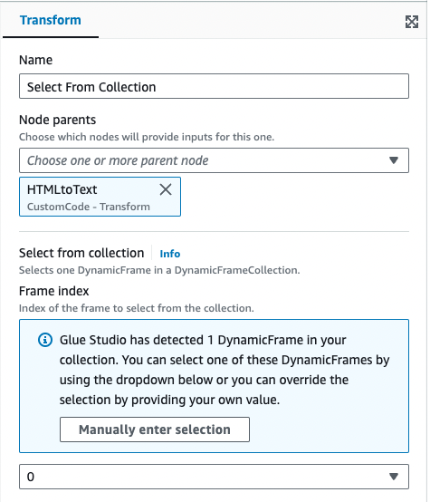
  
* Add a "Custom code" transform:

  
  
* Name the node "Sentiment Analysis" and add the following as the "Code Block".  This code takes the first 5000 characters of the comment and uses AWS Comprehend to determine the sentiment (positive, negative, or neutral) of the text:
 
  ```
  def SentimentAnalysis (glueContext, dfc) -> DynamicFrameCollection:
    
      from pyspark.sql.functions import udf
      @udf        
      def convert(comment):
        
          import textwrap
          comment = textwrap.wrap(comment, 5000, break_long_words=False)[0]
        
          import boto3
          AWS_REGION = 'us-east-1'
          client = boto3.client('comprehend',region_name = AWS_REGION)
          result = client.detect_sentiment(Text=comment, LanguageCode='en')
          return result['Sentiment']
    
      df = dfc.select(list(dfc.keys())[0]).toDF()
      df_filtered = df.withColumn("sentiment", convert("comment"))
      dyf_filtered = DynamicFrame.fromDF(df_filtered, glueContext, "sentiment_analysis")
      return(DynamicFrameCollection({"CustomTransform0": dyf_filtered}, glueContext))
  ```

* Add a "SelectFromCollection" transform:

  
  
* Use the default configuration for this node:

  
  

* Add a "S3 bucket" from the "Targets" menu

  
  
* Configure this node to save the data as JSON in your S3 bucket:

  * Format: JSON
  * Compression Type: None
  * S3 Target Location: The bucket you created
  * Data Catalog update options: Create a table in the Data Catalog and on subsequent runs, update the schema and add new partitions
  * Database: `mirrulations`
  * Table name: `comment_sentiment`

  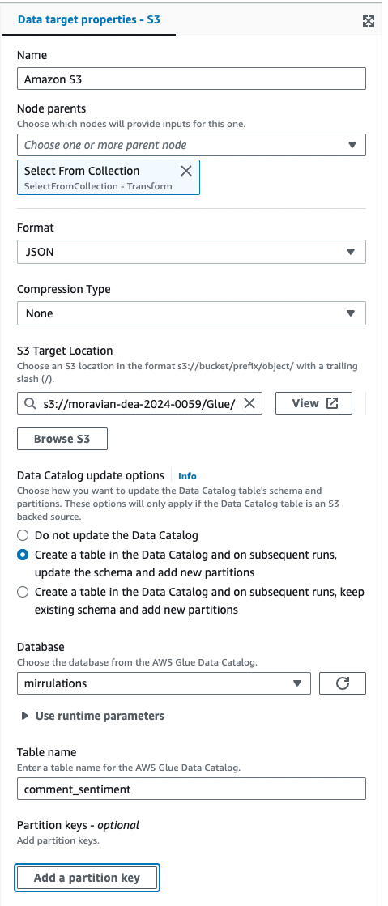

## Run Your ETL Job

* Save the Visual ETL and then click "Run"
* Click "Run Details" in the green bar at the top of the window to see the progress.
* Wait until the "Run Status" is "Complete" before continuing to the next step (5 to 10 minutes).

  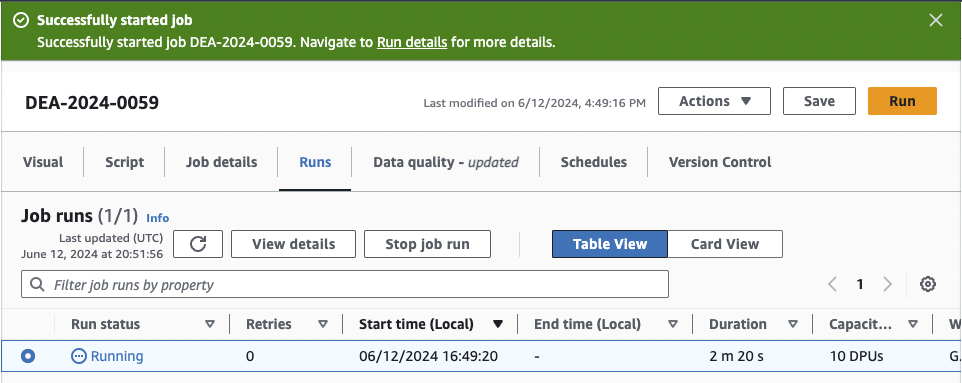

## View the Data

* In the AWS Glue dashboard under "Data Catalog" select "Tables"
* In the row for `comment_seniment` select "Table data."  Select "Proceed" when prompted to go to Athena.

  
  
* At the top of the Athena page select "Edit settings" to configure where Athena stores results.  In the page that opens, navigate to the "Athena" folder in the S3 bucket you created.

  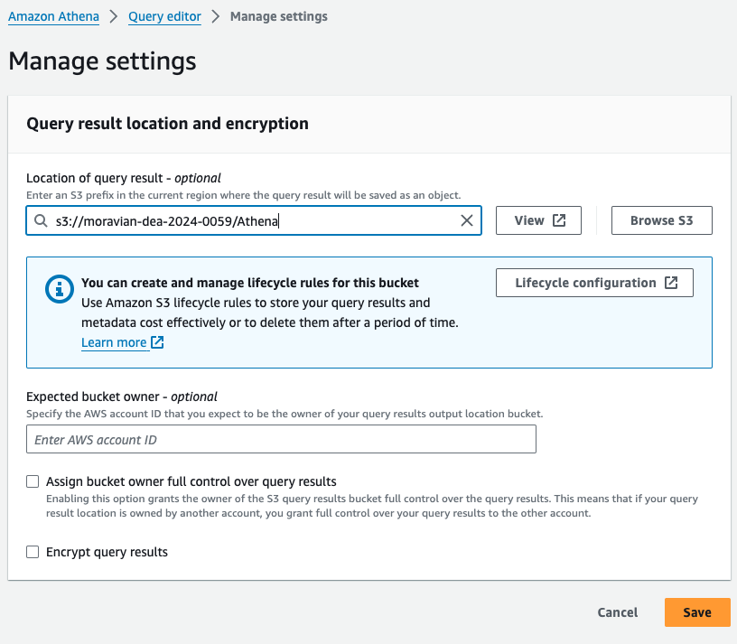

  
* Click on "Run Query" to generate 10 results

  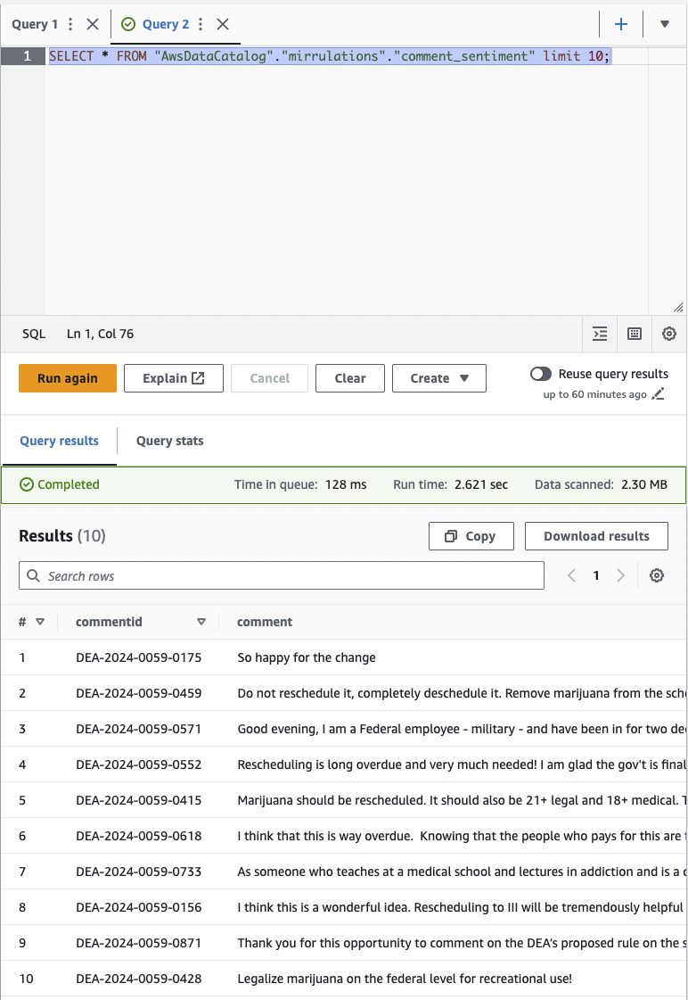


## Export Results to CSV

* Remove `limit 10` from the end of the query and click "Run again"
* Click on "Download results" to download a CSV file containing `commentId`, `comment`, `modifydate`, and `sentiment`.

  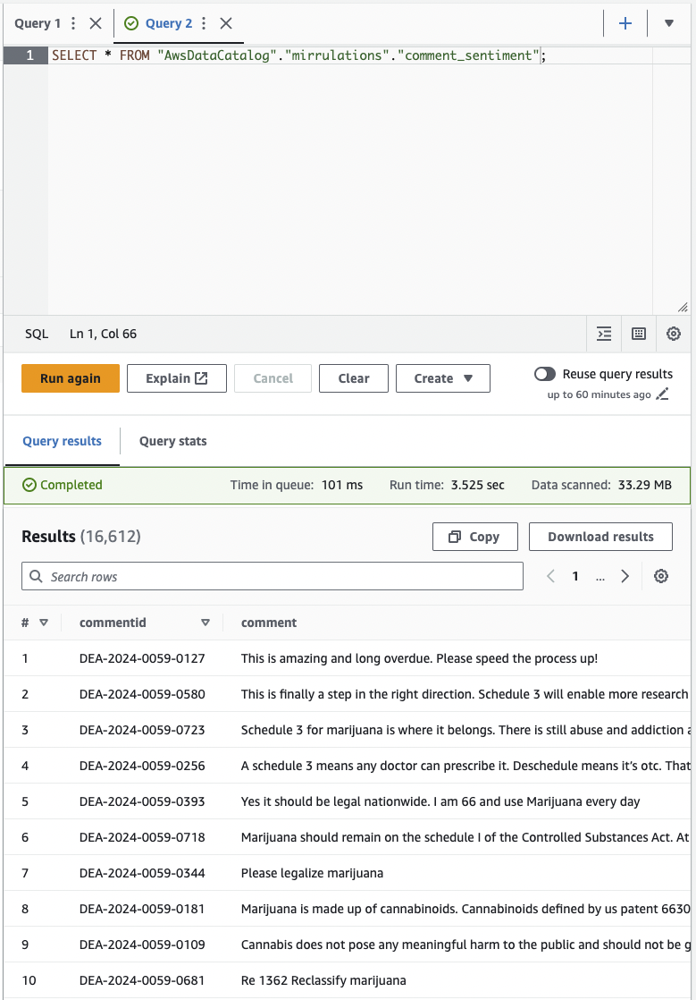


## Conclusion

Congratulations!  You have now extracted all the comments from `DEA-2024-0059`, determined whether the sentiment is positive, negative, or neutral, and exported a CSV dataset that you can use for further student of public comment on this issue.

## References

* [How to scale sentiment analysis using Amazon Comprehend, AWS Glue and Amazon Athena](https://aws.amazon.com/blogs/machine-learning/how-to-scale-sentiment-analysis-using-amazon-comprehend-aws-glue-and-amazon-athena/)
* [Tutorial: Analyzing insights from customer reviews with Amazon Comprehend](https://docs.aws.amazon.com/comprehend/latest/dg/tutorial-reviews.html)
* [Simplify data discovery for business users by adding data descriptions in the AWS Glue Data Catalog](https://aws.amazon.com/blogs/big-data/simplify-data-discovery-for-business-users-by-adding-data-descriptions-in-the-aws-glue-data-catalog/)